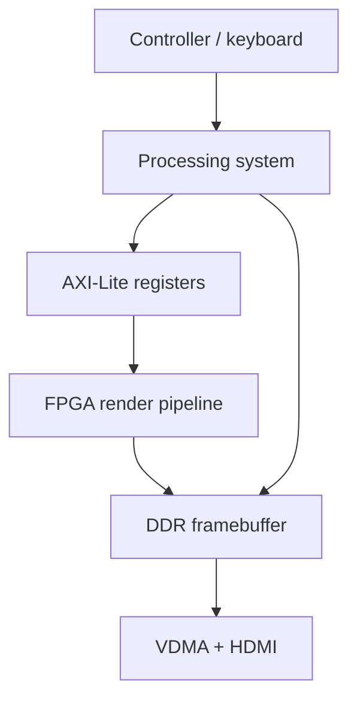
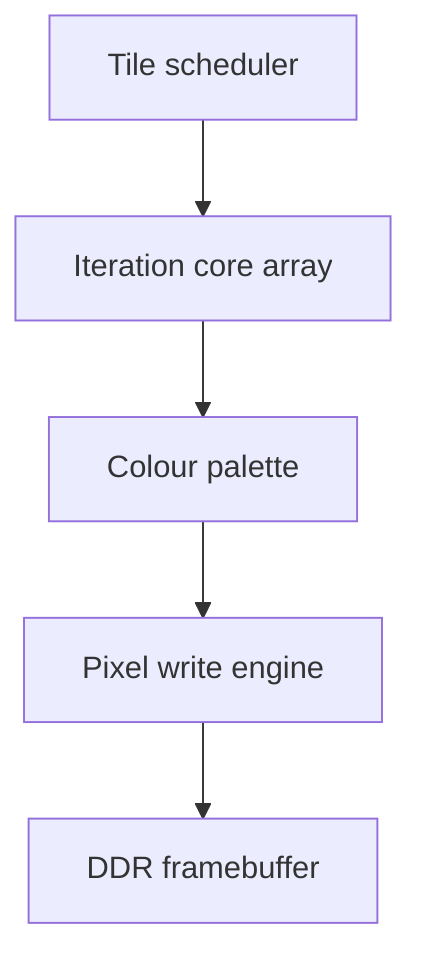
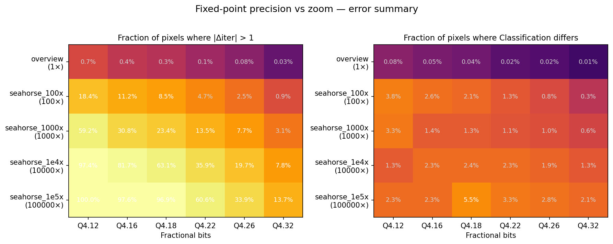

# FractalScope

FPGA-accelerated fractal visualisation system on the PYNQ-Z1, combining a SystemVerilog rendering accelerator with a Python processing-system application for interactive HDMI output.

> Public technical dossier. The implementation source is not published here because the original project was university coursework and may be subject to academic integrity restrictions. This repository documents the architecture, hardware design, processing-system design, testing approach, and project evidence without exposing restricted source code.

## Overview

FractalScope is an educational real-time fractal visualiser for Mandelbrot, Julia, Burning Ship, and Tricorn sets. The system combines:

- a 23-core FPGA fractal accelerator,
- a Python processing system running on the PYNQ-Z1,
- an HDMI framebuffer/display path,
- a custom controller input layer,
- guided educational scenes and free-roam exploration modes,
- a CPU baseline for performance comparison.

My main work was on the **FPGA hardware and hardware extensions** plus the **processing-system integration/application layer**.

## Key Results

| Area | Result |
|---|---|
| Board | PYNQ-Z1 / Zynq-7000 |
| Display | 1280 x 720 HDMI output |
| Hardware datapath | Signed Q4.22 fixed-point |
| Final accelerator | 23 parallel iteration cores |
| DSP usage | 212 / 220 DSP slices |
| Resource focus | Throughput, timing closure, and interactive latency |
| Supported sets | Mandelbrot, Julia, Burning Ship, Tricorn |
| Extensions | Progressive rendering, dirty rectangles, periodicity checking, Mariani-Silver tile fill, palette banking |
| Reported speedup | Up to 53x throughput over the multi-threaded CPU baseline at 2048 max iterations |

## What I Worked On

| Area | Contribution |
|---|---|
| FPGA accelerator | Iteration-core architecture, fixed-point datapath decisions, core scaling, AXI-facing render pipeline, timing/resource tradeoffs. |
| Hardware extensions | Progressive rendering, tile scheduling, dirty rectangles, periodicity checking, Mariani-Silver acceleration, runtime palette selection. |
| Pixel write path | Direct framebuffer write architecture using pixel indices, replacing the earlier reorder-buffer style approach. |
| Processing system | Python scene manager, PL backend integration, AXI-Lite register programming, framebuffer management, HUD overlays, controller abstraction, free-roam modes. |
| Integration/testing | PYNQ notebooks, RTL testbench strategy, hardware status-counter debugging, CPU-vs-PL comparison support. |

## System Shape

## Hardware Pipeline

The final hardware design moved away from a strict ordered streaming renderer and toward direct indexed framebuffer writes. This made out-of-order completion from many iteration cores easier to exploit.

## Number Format Study

The accelerator used signed Q4.22 fixed-point arithmetic. This was chosen as a practical balance between precision, zoom range, DSP usage, timing closure, and fitting many parallel cores on the PYNQ-Z1.

## Technology

- SystemVerilog / Verilog
- Vivado 2023.2
- AXI-Lite, AXI-MM, AXI4-Stream concepts
- PYNQ / Zynq-7000
- Python
- NumPy / Pillow
- C++ CPU baseline
- Jupyter-based hardware bring-up
- HDMI / VDMA framebuffer pipeline

## Notes for Recruiters

The source is private for academic integrity reasons, but this dossier records the technical architecture and design evidence. I can discuss implementation details, debug process, timing/resource tradeoffs, and PS/PL integration in interviews. Where permitted, I can provide supervised evidence of code ownership without making the restricted coursework solution public.

