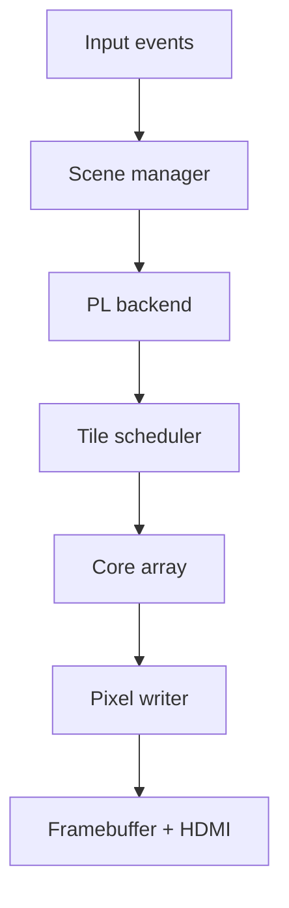

# Architecture

FractalScope was built as a hardware/software co-design project. The FPGA programmable logic handles the high-throughput pixel computation, while the processing system owns interaction, scene flow, register programming, framebuffer management, and overlays.

## Top-Level Split

| Layer | Responsibility |
|---|---|
| Controller/input | Physical controls and keyboard fallback converted into common application events. |
| Processing system | Scene manager, event routing, view-state updates, AXI-Lite programming, framebuffer handling, HUD composition, CPU comparison. |
| FPGA programmable logic | Fractal iteration, acceleration extensions, colour mapping, indexed framebuffer writes. |
| Display pipeline | DDR framebuffer readout through VDMA and HDMI output. |

## Runtime Flow

1. The user pans, zooms, changes iteration depth, changes palette, or switches scene.
2. The PS updates the active scene state.
3. For PL-backed scenes, the PS converts floating-point view parameters into Q4.22 register values.
4. The PS writes scheduler, palette, and pixel-writer registers.
5. The FPGA renders the active pass into DDR.
6. The PS composites HUD elements where needed.
7. The VDMA scans the framebuffer to HDMI.

## Supported Modes

- Guided educational scenes.
- PL-backed Mandelbrot demonstration.
- PL-backed Julia demonstration with Mandelbrot reference map.
- Free-roam Mandelbrot.
- Free-roam Julia.
- Free-roam Burning Ship.
- Free-roam Tricorn.
- CPU-vs-FPGA comparison.

## Design Principle

The project deliberately kept flexible UI and teaching logic in software while keeping repetitive pixel computation in hardware. This avoided rebuilding the FPGA bitstream for changes to menus, overlays, controller mappings, or educational content.

