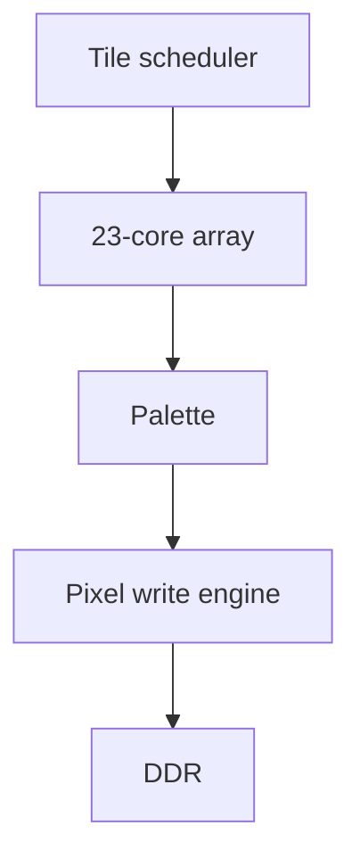

# FPGA Hardware

The hardware accelerator computes escape-time fractals using a parallel fixed-point datapath. The final version used 23 iteration cores on the PYNQ-Z1 and wrote coloured pixels directly into a DDR framebuffer.

## Final Hardware Characteristics

| Feature | Detail |
|---|---|
| Target board | PYNQ-Z1 |
| Resolution | 1280 x 720 |
| Numeric format | Signed Q4.22 fixed-point |
| Iteration cores | 23 |
| Max-iteration control | Runtime configurable from the PS |
| Fractal mode control | Runtime selectable mode register |
| Palette control | Runtime palette selection and scaling |
| Write path | Indexed pixel writes to DDR |
| Display path | DDR framebuffer read by VDMA for HDMI |

## Main Blocks

| Block | Role |
|---|---|
| Tile scheduler | Generates tile/pixel work, applies render scale, supports dirty regions and Mariani-Silver tile fills. |
| Iteration core array | Computes escape iterations in parallel using the fixed-point recurrence. |
| Arbiter/skid buffering | Manages valid/ready flow between parallel workers and downstream blocks. |
| Colour palette | Maps iteration results to RGB values with palette scaling and selection. |
| Pixel write engine | Writes coloured pixels to their indexed framebuffer addresses through AXI. |
| Performance/status counters | Exposes render and writer state to the PS for polling/debugging. |

## Fixed-Point Decision

Q4.22 was chosen to balance:

- enough range for the default fractal views,
- enough fractional precision for useful zooming,
- DSP usage per core,
- timing closure,
- the ability to instantiate many cores.

Wider formats would increase precision but would place more pressure on DSP use, routing, and timing. Narrower formats would make the fractal visibly inaccurate earlier during zooming.

## Hardware Extensions

| Extension | Purpose |
|---|---|
| Dirty rectangles | Skip regions that are later covered by opaque HUD panels. |
| Progressive rendering | Show a coarse image quickly, then refine at smaller render scales. |
| Periodicity checking | Exit repeated orbits early in stable regions. |
| Mariani-Silver | Fill uniform tiles without iterating every interior pixel. |
| Palette banking | Switch colour schemes without rebuilding the bitstream. |

## Timing and Resource Tradeoffs

The final version used 212 of 220 DSP slices. A 24-core design was considered, but the project kept 23 cores to avoid excessive LUT pressure, congestion, timing risk, and power/heat concerns.

The direct framebuffer write path was an important architectural change. Earlier designs used a reorder-buffer style path, but this became timing-heavy. The final design preserved each pixel's index and wrote it to the correct framebuffer address, allowing out-of-order core completion without requiring a large ordered stream buffer.

